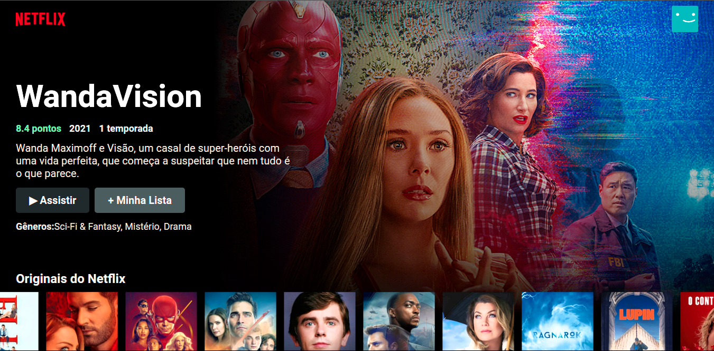
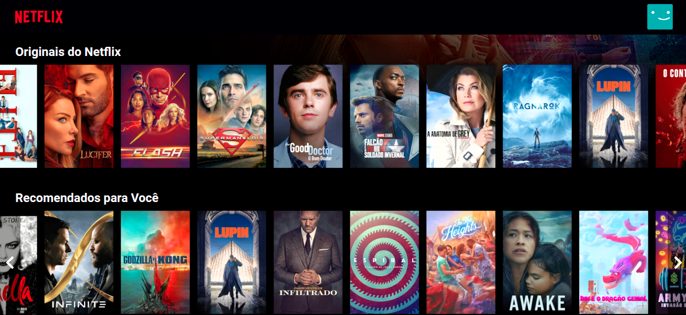

# Netflix Home
> Netflix homepage with React.js
> 
[](https://github.com/LucasAlvaresA/netflix-clone/actions/workflows/gh-pages.yml)

<div>
  
  
  
  
</div>

 
 

## Instalação

Após clonar o projeto:

```sh
npm install 
```

Depois execute:

```sh
npm start
```
